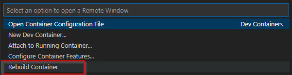
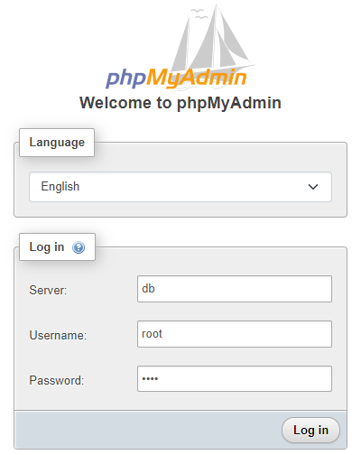

# Documentation Devcontainer
## Setup
The repository for this Project can easily be opened in a DevContaier via the buttons below.<br>
[](https://github.com/Faebel/python-web-db) <br>

When started, the web application automatically starts, as a health-check, to indicate, that the app works. <br>

To use it you first need to create a new `.env` file in the root-directory of the Repository. Easiest way is to copy the `env-schema.txt` and to change the variables. the `.env` file will be ignored by GIT.<br>

With the `.env` file created you can rebuild the DevContainer from VS Code. <br>
 <br>

### importing demo data into database
After the DevContainer restarted you must create the Database with some test-data with the `setup.sql` [script](../setup.sql).<br>
The easiest way to import the script, is to with phpMyAdmin. To do this login to phpMyAdmin on https://localhost:8080 with your credentials:<br>
**Server:** `db`<br>
**Username:** `root`<br>
**Password:** `MYSQL_ROOT_PASSWORD defined in .env`<br>
<br>

Paste the [SQL-script](../setup.sql) into phpMyAdmin and click GO. but first you need to configure the username and password in the script to what you defined in `.env` <br>

### Restarting the Python application
With the imported data in the database you can now restart the Python Flask web-application by pressing `ctrl+C` to close the program. <br>
To reopen the program you need to start it in the terminal with the following command: <br>
```shell
python main.py
```
With everything working, you can go to http://localhost:5000 in your browser and see the website and if everything works.

## Devcontainer Structure

The Devcontainer is set up using a Docker-Compose file, which orchestrates multiple services to create a development environment. The file defines three services: app, db, and tool. <br>
This Docker-Compose setup is designed to create a comprehensive development environment that includes a Python application, a MySQL database, and a database management tool (phpMyAdmin). The app service allows developers to build and run a Python application, the db service provides the necessary database backend, and the tool service offers an easy-to-use interface for managing the database. This setup ensures that developers can work efficiently with a pre-configured and consistent environment, facilitating smooth development workflows and easy database management.

### Services
**App Service (app):**

*Image:* The app service uses the mcr.microsoft.com/devcontainers/python:1-3.12-bullseye image, which is a pre-configured container for Python development. <br>
*Ports:* The service maps port 5000 on the host to port 5000 in the container. This is typically used for running a web application or API. <br>
*Environment Variables:* Several environment variables are defined for database connectivity, using values from the host system’s environment. These include:
- DATABASE_URL
- MYSQL_DATABASE
- MYSQL_USER
- MYSQL_PASSWORD <br>

*Dependencies:* The app service depends on the db service, ensuring that the database is started before the app.

**Database Service (db):**

*Image:* The db service uses the mysql:5.7 image, which provides a MySQL database. <br>
*Ports:* The service maps port 3306 on the host to port 3306 in the container, which is the default MySQL port. <br>
*Volumes:* A named volume dbdaten is used to persist the database data, mapping to /var/lib/mysql in the container. <br>
*Environment Variables:* Environment variables are defined to set up the MySQL database, including:
MYSQL_ROOT_PASSWORD
MYSQL_DATABASE
MYSQL_USER
MYSQL_PASSWORD

**Tool Service (tool):**

*Image:* The tool service uses the phpmyadmin image, which provides a web-based interface for managing MySQL databases. <br>
*Ports:* The service maps port 8080 on the host to port 80 in the container. <br>
*Environment Variables:** The PMA_ARBITRARY environment variable is set to 1, enabling arbitrary server connections in phpMyAdmin. <br>
*Dependencies:* The tool service depends on the db service, ensuring that the database is available for phpMyAdmin to connect to. <br>

## VSCode Extensions
### Python
This is the essential VS Code extension for Python, developed by Microsoft itself. While creating a .py file, VS Code will itself suggest installing this extension. It provides features like analyzing code for potential errors, code formatting, debugging through a debug console, testing with the unit test, pytest, and nose test frameworks. Syntax checking, auto-completion, auto-activation, and switching between different environments are also done by this extension. Moreover, it supports Jupyter Notebooks and therefore is considered as the very basic and important Python extension.

https://marketplace.visualstudio.com/items?itemName=ms-python.python

### Python Debugger
Python Debugger provides a seamless debugging experience by allowing you to set breakpoints, step through code, inspect variables, and perform other essential debugging tasks. The debugpy extension offers debugging support for various types of Python applications including scripts, web applications, remote processes, and multi-threaded processes.

https://marketplace.visualstudio.com/items?itemName=ms-python.debugpy

### Python Snippets
Python Snippets extension is very useful for beginners who are new to this language. It contains built-in snippets for lists, strings, dictionaries, tuple, class, etc with at least one example of each of them. It avoids typing the code again and again by using its snippets directly. Thus, we can say this extension is beginner-friendly and saves a lot of time for Python developers.

https://marketplace.visualstudio.com/items?itemName=frhtylcn.pythonsnippets

### AREPL for python
It provides code evaluation in real-time. As you start typing, the code will keep on running which helps to check if the code is right or not during the time of writing itself. If an error is found, it will be reflected in the editor instantly with logs. It can be configured accordingly to fit user experience from the settings. One doesn’t need to run the code, AREPL automatically evaluates it.

https://marketplace.visualstudio.com/items?itemName=almenon.arepl